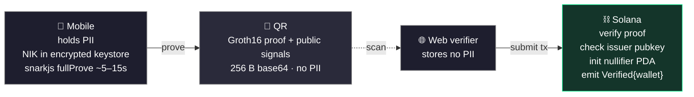

# 影 Kage

### Privacy-preserving identity, proven from the shadows.

*The proof steps into the light. Your identity stays in the dark.*

---

## Kage — 影 / かげ

**Meaning:** *shadow, silhouette.*

The verification is a shadow of you — its shape is enough to prove you're real and valid, while the substance casting it never leaves the dark. Zero-knowledge identity, by design.

---

## Who we are

We build **zero-knowledge identity** infrastructure. Traditional KYC forces you to hand over your name, ID number, and date of birth — and every verifier that stores it becomes a breach waiting to happen.

Kage flips the model: the user holds their own credential, proves a *predicate* about it (e.g. "age ≥ 18", "is a verified resident") on-device, and the verifier learns **only the answer** — never the underlying data.

> **One breach of a traditional KYC store = mass PII leak.**
> **One breach of a Kage verifier = nothing useful.**

---

## 🔬 Flagship project — `proven-kyc`

A working zero-knowledge e-KYC demo. A user proves they hold a valid Indonesian KTP identity card **and** are age ≥ 18 — without revealing their NIK, name, or date of birth. A Solana program checks the proof on-chain and rejects replays.

### What makes it work

| Layer | Tech | Role |
|-------|------|------|
| **Circuit** | Circom 2.x + Groth16 | proves `age ≥ 18` + valid issuer signature |
| **Mobile** | React Native / Expo + snarkjs | holds PII, proves on-device, shows QR |
| **Web verifier** | React / Vite | scans QR, submits tx, stores zero PII |
| **On-chain** | Anchor (Solana) | verifies Groth16, nullifier PDA blocks replays |
| **Issuer** | Node mock | signs credentials, manages `NIK → secret` for nullifiers |

### Privacy contrast

| | Traditional KYC | Kage |
|---|---|---|
| Verifier stores | `{ NIK, name, address }` | `{ wallet, nullifier, slot }` |
| One breach | mass PII leak | nothing useful |
| Sybil-resistant | ✅ (but linkable everywhere) | ✅ (via nullifier) |
| User reveals | everything | a single `pass` bit |

➡️ **[Explore the repo →](https://github.com/KageHQ/proven-kyc)**

---

## 🧭 Principles

- **Data minimization** — verifiers learn the predicate result, nothing more.
- **Self-custody of identity** — PII lives in the user's device keystore, not a central DB.
- **On-chain accountability** — proofs are verified trustlessly; replays are rejected by construction.
- **Honest scope** — we ship demos labeled as demos. See each repo's *Honest limitations* section.

---

## 🚧 Current status

`proven-kyc` is a **campus / hackathon demo** that shows the *shape* of zk-KYC, not a production system. Known gaps we're upfront about:

- **Mock issuer** — signs without checking a real document (swap in a government eID / certified KYC provider).
- **Global nullifier** — same across verifiers, so verifications are linkable (production: salt per verifier).
- **Single-contributor trusted setup** — one fixed demo contribution (production: multi-party ceremony).
- **No date oracle** — `currentDate` is a fixed input, spoofable via clock rollback (production: bind to on-chain slot).

---

**Built on Solana · Powered by Groth16 zk-SNARKs**

*影 — identity you control, verification you can trust.*

