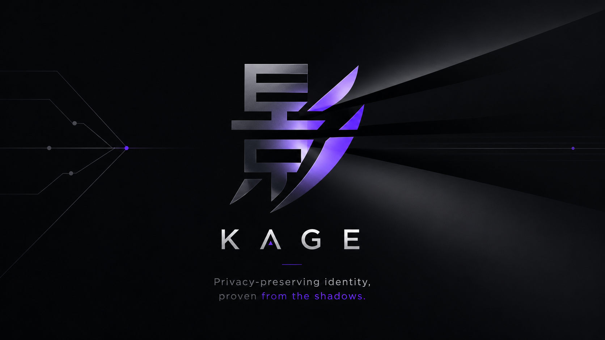
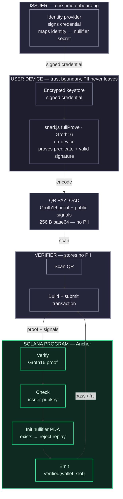

# Kage

*The proof steps into the light. Your identity stays in the dark.*

The verification is a shadow of you — its shape is enough to prove you're real and valid, while the substance casting it never leaves the dark. **Kage** (影 / かげ — *shadow, silhouette*) is zero-knowledge identity, by design.

---

## Who we are

We build **zero-knowledge identity** infrastructure. Traditional KYC forces you to hand over your name, ID number, and date of birth — and every verifier that stores it becomes a breach waiting to happen.

Kage flips the model: the user holds their own credential, proves a *predicate* about it (e.g. "age ≥ 18", "is a verified resident") on-device, and the verifier learns **only the answer** — never the underlying data.

> **One breach of a traditional KYC store = mass PII leak.**
> **One breach of a Kage verifier = nothing useful.**

---

## How it works

The user holds a signed credential on their device, generates a Groth16 proof of a predicate on-device, and shows it as a QR. The verifier submits the proof to a Solana program, which checks it and rejects replays — learning nothing but the result.

### Privacy contrast

| | Traditional KYC | Kage |
|---|---|---|
| Verifier stores | `{ id, name, address }` | `{ wallet, nullifier, slot }` |
| One breach | mass PII leak | nothing useful |
| Sybil-resistant | ✅ (but linkable everywhere) | ✅ (via nullifier) |
| User reveals | everything | a single `pass` bit |

---

## Principles

- **Data minimization** — verifiers learn the predicate result, nothing more.
- **Self-custody of identity** — PII lives in the user's device keystore, not a central DB.
- **On-chain accountability** — proofs are verified trustlessly; replays are rejected by construction.
- **Honest scope** — we ship demos labeled as demos, and document their limits.

---

**Built on Solana · Powered by Groth16 zk-SNARKs**

*影 — identity you control, verification you can trust.*

